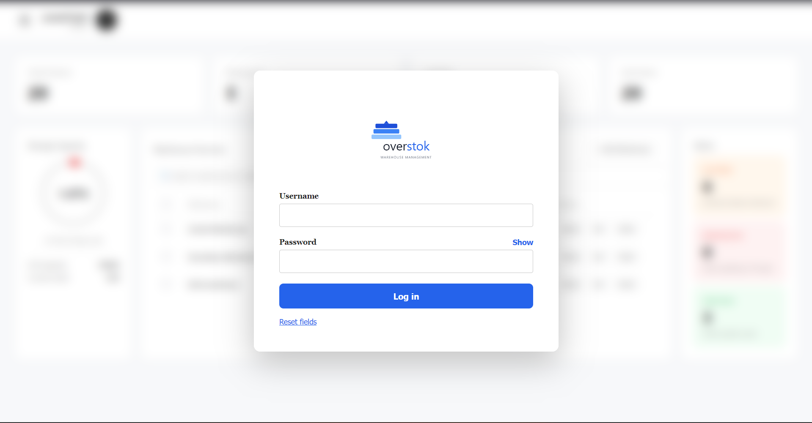
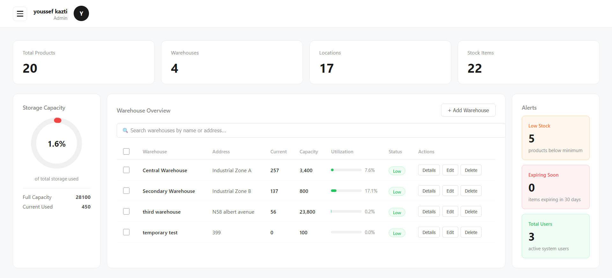
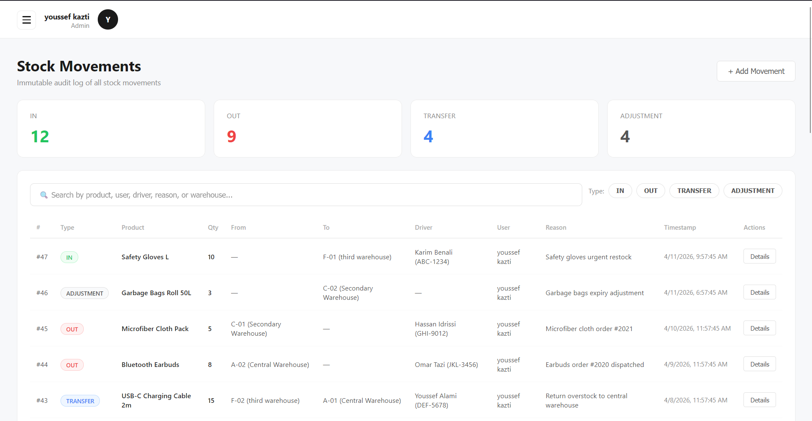
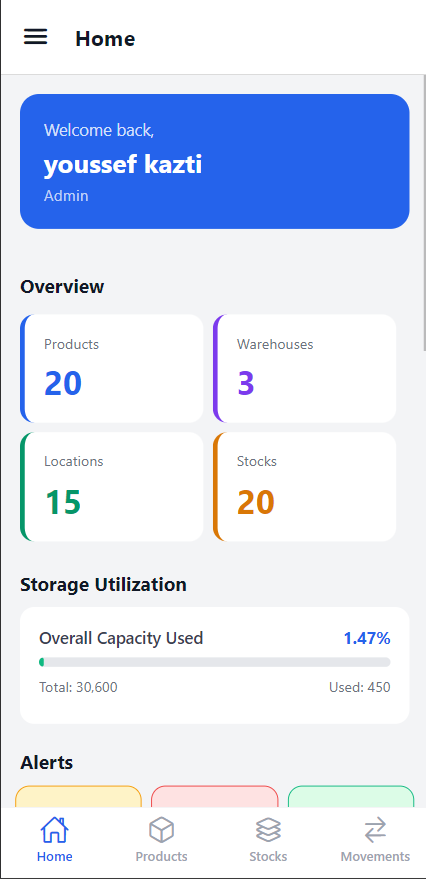
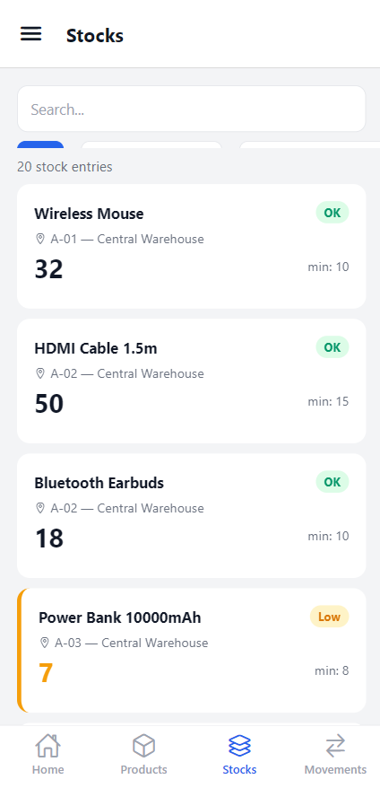
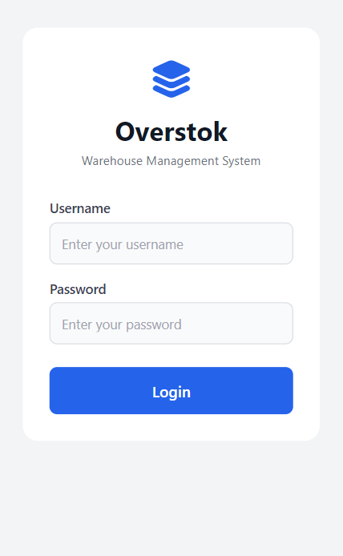

# Overstok — Warehouse Management System

A full-stack warehouse management system built as a Final Year Project (2026). Overstok provides real-time stock tracking, role-based access control, movement logging, and driver/truck management across a web app and mobile app.

---

## Screenshots

### Web App
| Login | Dashboard | Stocks |
|-------|-----------|--------|
|  |  |  |

### Mobile App
| Dashboard | Stocks | Login |
|-----------|--------|-------|
|  |  |  |

---

## Tech Stack

| Layer | Technology |
|-------|------------|
| Backend | Laravel 11, MySQL, Sanctum |
| Frontend | React 18, Axios, React Router |
| Mobile | React Native, Expo, React Navigation |
| Auth | Laravel Sanctum (token-based) |

---

## Features

- Role-based access control — Admin, Operator, Viewer
- Multi-warehouse management with capacity tracking
- Product catalog with minimum stock level alerts
- Stock tracking across locations
- Automatic movement logging (IN / OUT / TRANSFER / ADJUSTMENT)
- Driver & truck management
- Real-time dashboard with utilization charts and alerts
- Mobile read-only app with drawer navigation

---

## Project Structure
overstok/
├── backend/       # Laravel 11 REST API
├── frontend/      # React 18 web app
├── mobile/        # React Native Expo mobile app
└── screenshots/   # App screenshots
---

## Requirements

| Tool | Version |
|------|---------|
| PHP | >= 8.2 |
| Composer | >= 2.0 |
| Node.js | >= 18 |
| MySQL | >= 8.0 |
| Expo Go | Latest |

---

## Installation

### 1. Clone the repo

```bash
git clone https://github.com/yosfixe/WareHouse-Management-System.git
cd WareHouse-Management-System
```

### 2. Backend setup

```bash
cd backend
composer install
cp .env.example .env
php artisan key:generate
```

Update `.env` with your database credentials:
## Default Credentials

|  Role |     Username    | Password  |
|-------|-----------------|-----------|
| Admin | admin@gmail.com | admin1234 |

---

## License

MIT

---

## Acknowledgements

Special thanks to **Claude** (Anthropic) for the assistance, guidance, and patience throughout this entire project — from database design and Laravel backend, to React frontend, React Native mobile app, and even the presentation. This project would not have been the same without that support.

> *"5 months of building, debugging, and learning — one conversation at a time."*
